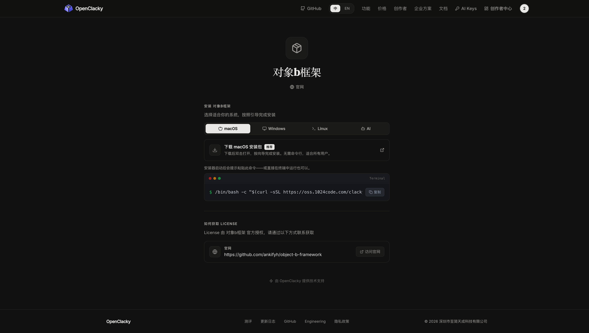

# 对象B框架（Object B Framework）

<p align="center">
  <a href="https://www.openclacky.com/claw/objectb"></a>
  <a href="https://github.com/ankifyh/object-b-framework/blob/main/LICENSE"></a>
  <a href="https://www.openclacky.com/claw/objectb"></a>
</p>

> **一个关于人类情绪与认知机制的原创模型。**
>
> 适用于希望理解自己的情绪结构、减少内耗、提升执行力的个人，以及心理咨询师、教练等专业人士。

**一句话核心：情绪不是由世界引起的，而是由内心两个预期的冲突引起的。**

**框架精髓：**
- 没有事实，只有预期 — 所有"事实"都是另一个被固化的预期
- 你永远不会被现实伤害，只会被自己的一个预期与另一个预期的战争耗尽
- 识别预期的方法：每当情绪升起，问"我此刻预测下一刻会发生什么？"

---

## 🚀 快速开始

### 通过 OpenClacky 安装（推荐）

```bash
openclacky install objectb
```

或访问产品页面一键安装：[对象B框架 →](https://www.openclacky.com/claw/objectb)

### 试用 & 付费

| 计划 | 价格 | 说明 |
|------|------|------|
| 7天免费试用 | 免费 | 完整功能体验 7 天 |
| 年度版 | $99/年 | 正式使用，含所有更新 |

前 10 位用户可申请免费年度 License。

### 自行部署

```bash
git clone https://github.com/ankifyh/object-b-framework.git
cd object-b-framework
```

---

## 🎯 适用人群

| 人群 | 能获得什么 |
|------|-----------|
| **正在经历情绪困扰的人** | 看懂自己的情绪从哪来，不再被情绪裹挟 |
| **想减少内耗的思考者** | 识别内心两种预期的冲突，停止自我消耗 |
| **心理咨询师 / 教练** | 一套结构化的情绪分析工具，提升干预效率 |
| **写作者 / 创作者** | 破解"创作卡壳"的结构性原因，提升执行力 |
| **对人类认知感兴趣的人** | 一个独特的认知模型，融合多学科视角 |

> 如果你曾有过"我明明知道不该焦虑但就是控制不住"、"我知道该做事但就是拖着"、"那个破事明明过去了但我还在气"——**对象B框架就是为你准备的**。

---

## 📸 快速预览

<!-- TODO: 替换为实际截图 -->
<p align="center">
  
</p>

<details>
<summary><b>📝 点击查看完整使用示例</b></summary>

**焦虑分析**

```
对象D：焦虑 → 对象负D
对象负B：你预测即将发生的事会带来负面结果
可能的对象C：
  - 某一项看似困难的任务（模拟C）
  - 某个不确定性高的事悬而未决（事实C不确定）

验证模式：对象负B + 对象负C → 对象负F

应对：
1. 把对象B写出来："我预测____会发生"
2. 区分事实C和模拟C（哪些是想象的困难？）
3. 找到你能控制的极小对象正C
```

完整示例见 [examples/](examples/) 目录。

</details>

---

## 📖 核心概念

### 基础三要素

| 概念 | 定义 | 说明 |
|------|------|------|
| **对象B (Object B)** | 底层的预测/预期 | 杏仁核里的安全/危险二值flag，比"预期"更底层、更自动、不可直接觉察。对象B即小我。 |
| **对象C (Object C)** | 验证对象B的"现实" | 可能是真实发生的事件，也可能是头脑中的想象/认知。**对象C的本质其实是另一个对象B**。 |
| **对象D (Object D)** | 情绪、生理反应 | B被C验证后的输出结果。 |

### 四种验证模式（对象F）

| 模式 | 组合 | 结果 |
|------|------|------|
| **对象++** | 正B + 正C | 正D（快乐、满足） |
| **对象+-** | 正B + 负C | 负D（愤怒、失望） |
| **对象-+** | 负B + 正C | 正D（惊喜） |
| **对象--** | 负B + 负C | 负D（恐惧、抑郁） |
| **对象hh** | 中性B + 中性C | 中性（无情绪） |

### 完整概念体系

| 概念 | 定义 |
|------|------|
| **对象A** | 欲望、动机（借鉴拉康对象a），所有欲望的抽象 |
| **对象AA** | 行动/行为，源于对象A |
| **对象E** | 防御机制，间接源自D，直接源自B |
| **对象F** | 验证事件的发生（实际或模拟） |
| **对象G** | 内摄、模仿、经验——反作用于B的东西 |
| **对象H** | 中性状态 |
| **对象J** | 从情绪（D）反推B的过程 |
| **对象K** | G反作用于B的过程 |
| **对象L** | B影响模拟C的过程（预期影响想象） |
| **对象M** | 反向操作框架达成目的（类似反射） |

---

## 🧭 五大应用场景

| 场景 | 解决的问题 |
|------|-----------|
| **情绪归因分析** | 拆解当前情绪的结构，找到源头 |
| **认知重构** | 区分"事实C"和"模拟C"，打破思维牢笼 |
| **人际理解** | 别人的愤怒不是冲你来的，是他自己的B没被满足 |
| **决策与执行** | 破解"我知道该做但拖着"的结构性原因 |
| **自我觉察训练** | 练习对象J，越来越了解自己的底层预期模式 |

每一个场景都有完整的分析模板，详见 [SKILL.md](SKILL.md) 或通过 OpenClacky 安装后直接使用。

---

## 🧠 核心洞察（框架精髓）

1. **没有事实，只有预期** — 所有"事实"都是另一个被固化的预期
2. **情绪是两个预期的战争** — 你永远不会被现实伤害，只会被自己的一个预期与另一个预期的战争耗尽
3. **识别预期的方法** — 每当情绪升起，问"我此刻预测下一刻会发生什么？"
4. **对象B不可直接调整** — 只能通过可控的模拟对象C间接调节
5. **对象C本质上是另一个对象B** — 看似C验证B，实则是两种B冲突
6. **臣服实验的方法** — 不听从任一小我，听从自然/道/良知
7. **愤怒的本质是失控** — 你的计划（B）没有得到预期（正C）的验证
8. **恐惧与欲望是一体两面** — 恐惧是对象负D，欲望是对象正B
9. **内阻力的根源** — 正B遭遇持续的微负C链（每个细微步骤偏离预期）
10. **忘掉这些推论是游戏的一部分** — 当你想起时，笑一下，继续玩

---

## 📄 许可

本项目采用 [MIT 许可证](LICENSE)。

---

## 👤 关于作者

**掘信息** — 一个持续探索认知边界的独立思考者。

> 对象B写在杏仁核里。知行合一追求的"知"就是杏仁核里的这个知，不在前额叶皮层。
>
> 忘掉这些推论是游戏的一部分。当你想起时，笑一下，继续玩。

---

<p align="center">
  <a href="https://www.openclacky.com/claw/objectb">安装对象B框架 →</a>
</p>
